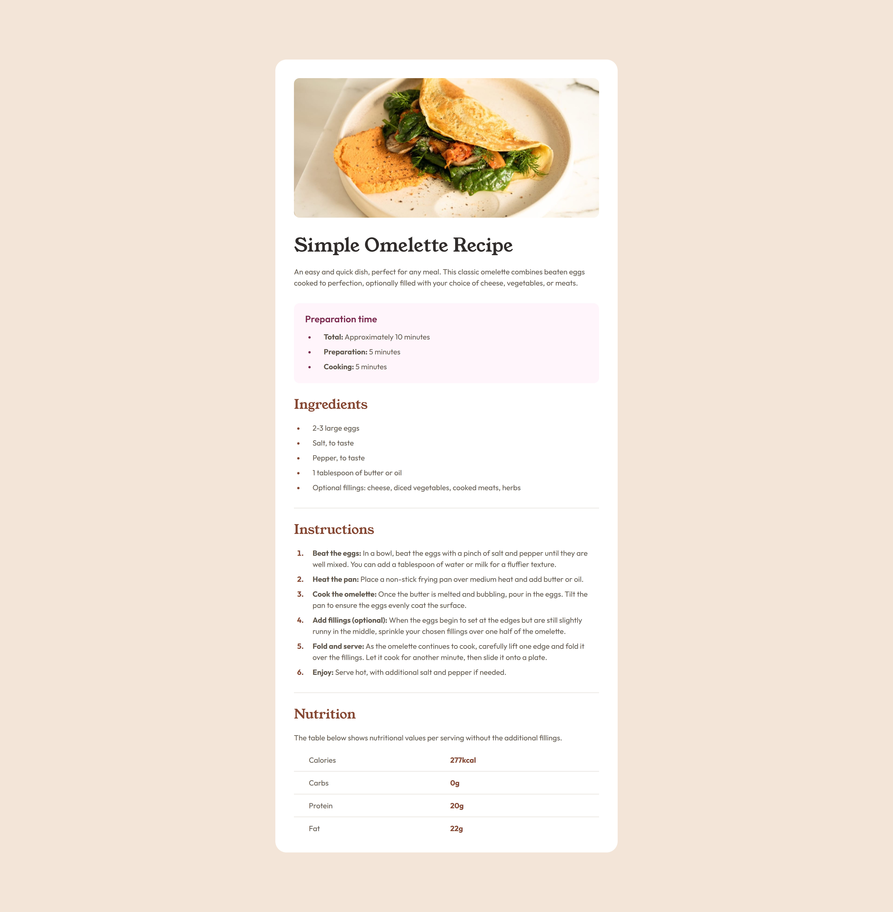
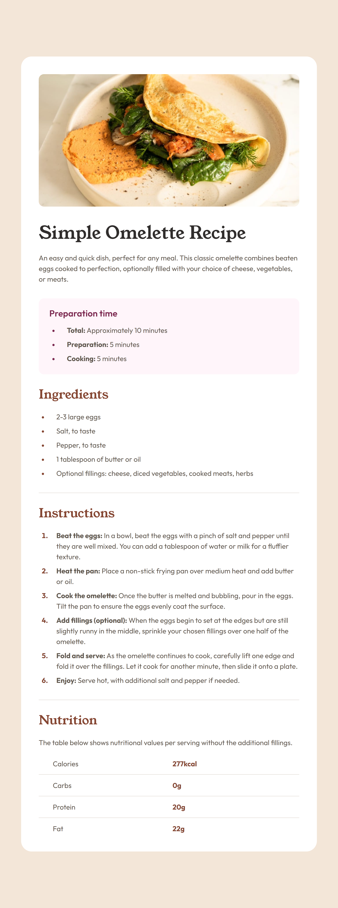
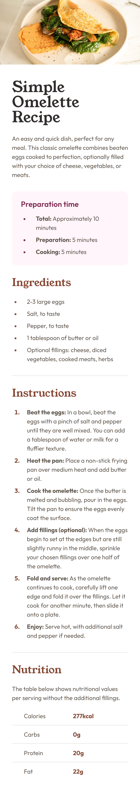

# Frontend Mentor - Recipe page solution

This is a solution to the [Recipe page challenge on Frontend Mentor](https://www.frontendmentor.io/challenges/recipe-page-KiTsR8QQKm). Frontend Mentor challenges help you improve your coding skills by building realistic projects.

## Table of contents

- [Overview](#overview)
  - [Screenshot](#screenshot)
  - [Links](#links)
- [My process](#my-process)
  - [Built with](#built-with)
  - [What I learned](#what-i-learned)
  - [Useful resources](#useful-resources)

## Overview

### Screenshot

Desktop:

Tablet:

Mobile:

### Links

- Challenge solution: [Add solution URL here](https://your-solution-url.com)
- Live site: [Add live site URL here](https://your-live-site-url.com)

## My process

### Built with

- Vue
- SCSS
- Custom CSS properties
- Semantic HTML5 markup
- Mobile-first workflow
- Responsive design
- CSS Grid

### What I learned

* I learned how to keep track of every detail in the Figma mockups.
* I made the page responsive by using fluid design and media queries.
* I also learned how to style lists with CSS.

### Useful resources

- [How to create and style lists with HTML and CSS - YouTube](https://www.youtube.com/watch?v=bRYwmmLC_Ns) - How to style lists with CSS.
- [Get your stylesheets more organized with Sass partials - YouTube](https://www.youtube.com/watch?v=9Ld-aOKsEDk) - My SCSS folder structure is inspired by this video.
